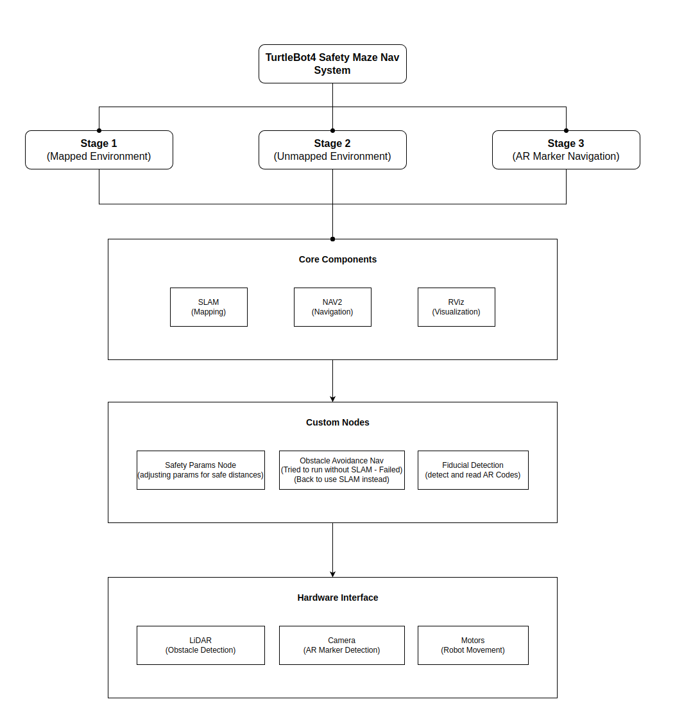

# 5335-final-project
Keep the robot safe while traversing through mazes. 

## Stages and progress
| Stage | Simulation Progress | Physical Robot Progress |
| ----- | ------------------- | ----------------------- |
| S1 - all obstacles mapped out | 100% - implemented, video recorded | N/A |
| S2 - no obstacles mapped out | 100% - implemented, video recorded | to be tested |
| S3 - have fiducial codes guiding the robot | implemented, can't test in simulation | to be tested |

## Installation and Running
### System Requirements
- Make sure these ROS2 and these ROS2 packges are installed
    - ros-humble-turtlebot4-bringup, 
    - ros-humble-turtlebot4-base 
- For simulation runs, make sure Gazebo Simulator, Ignition Fortress are installed
- cd into turtlebot4_ws directory for all commands below

### Installation
- To clean up installs/builds/logs: `make clean-up`
- To install required Python packages: `make python-setup`
- To build all packages: `make build-all`
- To only build the core project (without simulator packages): `make build-safety`

### Running
#### Run with Physical Turtlebot4 Lite
- Stage 2: `make run-s2`
- Stage 3: `make run-s3`
#### Run with Simulation
- Stage 1:
    - Terminal 1: `make run-sim-boxes`
    - Terminal 2: `make launch-node-adj`
- Stage 2: `make run-s2-sim`
- Stage 3: `make run-s3-sim`
#### Test virtual world and map setups
- Map with boxes: `make run-sim-boxes`
- Map without boxes: `make run-sim-empty`
- To map the environment: `make run-mapping`

### When Gazebo Simulator and Rivz started
- Create a starting pose in RViz matching the robot's starting pose
- Then you will be able to set goal pose and let it navigate through to the goal pose

## Project Technical Design

### Three Operating Stages:
- Stage 1: Environment with all obstacles mapped
- Stage 2: Environment with no obstacles mapped (SLAM on-the-fly)
- Stage 3: Environment with fiducial (AR) markers for navigation guidance

### Core ROS2 Components:
- SLAM node for real-time mapping
- Nav2 navigation stack for path planning and execution
- RViz for visualization and manual goal setting

### Custom Nodes:
- safety_params.py: Dynamically adjusts navigation safety parameters
- obstacle_avoidance_nav.py: Custom navigation with enhanced obstacle avoidance
- fiducial_detection_node.py: Detects AR markers using camera feed
- direction_navigation_node.py: Processes direction commands from markers

### Data Flow:
- LiDAR sensor → SLAM/Nav2 → Obstacle avoidance → Motor commands
- Camera → Fiducial detection → Direction commands → Navigation goals
- Safety parameters continuously adjust Nav2 behavior

### Key Technologies:
- ROS2 Humble
- OpenCV (ArUco marker detection)
- Nav2 navigation stack
- TF2 for coordinate transformations
- Gazebo/Ignition for simulation
